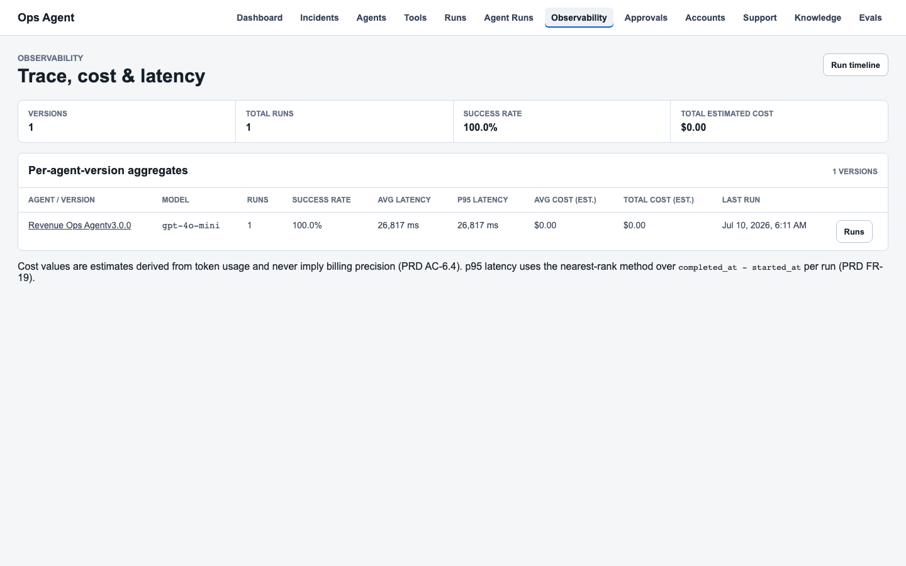
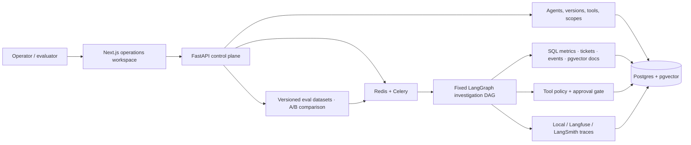
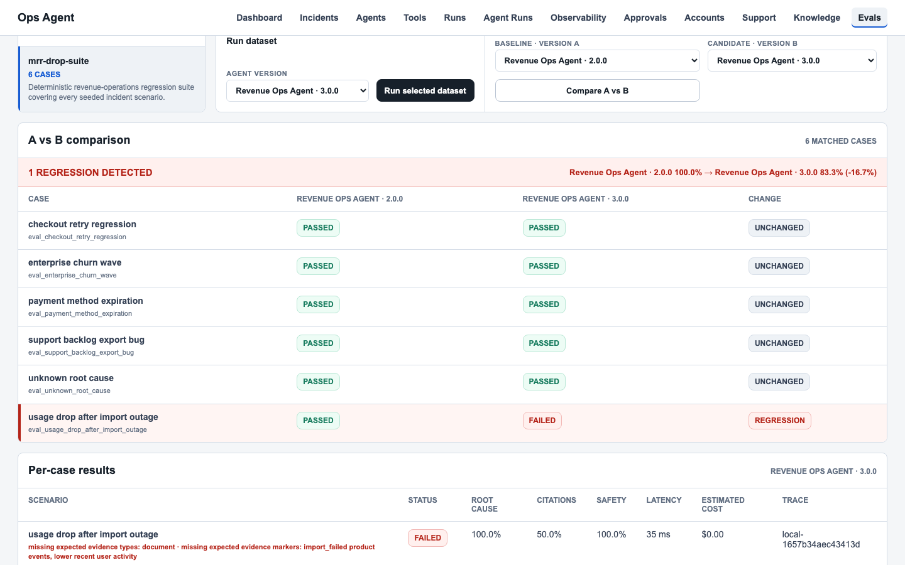

# Ledger

**Ledger is a production-shaped SaaS revenue investigation agent:** it turns an MRR drop into a cited root-cause report, an approval-gated action queue, and an auditable run trace - not a fluent chat summary.



| | |
| --- | --- |
| **Live demo** (anonymous, read-only) | [ledger.leihuang.me](https://ledger.leihuang.me) |
| **Case study** | [leihuang.me/work/ledger](https://leihuang.me/work/ledger/) |
| **Walkthrough** | [docs/assets/ledger-walkthrough.webm](docs/assets/ledger-walkthrough.webm) (~3 min) · [narrated script](docs/demo-script.md) |

> **Honest positioning.** Portfolio system with **synthetic business data**. Public demo is **read-only**. Root cause comes from a **deterministic classifier**; the optional LLM synthesizes wording and is adopted only when it agrees. Slack/email/CRM/task actions are **mocks behind approval**. Stripe is an **optional test-mode evidence adapter** (ingestion only; not live commerce). No merchant adoption or live-customer claims.

Two connected portfolio surfaces in one repo:

1. **Investigation agent** - anomaly → multi-source evidence → cited report → approval-gated drafts → run trace.
2. **Agent control plane** - immutable agent versions, tool registry, launchable runs, cost/latency dashboard, global approval queue, A-vs-B evals.

---

## Problem and primary scenario

A fluent incident summary is easy to demo and hard to trust. Operators need to know which evidence was retrieved, which agent version and tools ran, what failed, how much it cost, whether a change regressed quality, and whether a proposed action crossed an approval boundary.

**Primary demo prompt: "MRR dropped this week."** The seeded dataset embeds six incident scenarios (including one ambiguity case) with confounders: failed renewals, enterprise churn, usage outages, support backlog bugs, payment-method expiry, and an intentional unknown-root-cause path. Answers require joining metrics, invoices, tickets, product events, and knowledge docs - not a single obvious row.

---

## Architecture



The investigation graph is a **fixed linear DAG** (compiled per run). Published agent versions snapshot prompt, model, tools, and scopes; they are immutable through the runtime API. Every run persists steps, blocked calls, trace reference, usage/cost estimates, final report, mock actions, and approval decisions.

| Question | Surface |
| --- | --- |
| What changed? | Revenue dashboard + incident evidence |
| Why trust the diagnosis? | Run report, citations, step timeline, trace |
| What can this version do? | Agent version + tool registry |
| Can it act without approval? | Tool scopes, mock actions, approval queue |
| Did a version regress? | Eval Studio A-vs-B |
| Cost / latency? | Observability dashboard |

---

## Evidence flow: anomaly → cited report

1. **Anomaly** - dashboard/metrics detect MRR movement and link to a seeded incident.
2. **Investigate** - workflow retrieves SQL metrics, invoices, support tickets, product events, and knowledge excerpts through explicit tools (permission-checked).
3. **Classify** - a deterministic evidence classifier selects the scenario signature (or the uncertainty path). Optional LLM rewrites the diagnosis only when it agrees with that signature.
4. **Report** - final report lists root cause, contributing factors, affected accounts, and **citations** to retrieved SQL, tickets, documents, or incidents. Claims without retrieved evidence are not emitted.
5. **Act (gated)** - recommended follow-ups become mock actions; high-risk ones open approval requests and stay blocked until approve/reject.
6. **Audit** - step log, trace id, token/cost estimate, failures, and approval outcomes remain reconstructable from the database.

Primary workspace routes: `/incidents`, `/agent/runs/{id}`, `/approvals`, `/evals`, `/dashboard`.

---

## Approval and mutation safety

| Boundary | Behavior |
| --- | --- |
| High-risk mock actions | Create pending approval requests; cannot execute until approved or rejected |
| External writes | Slack, email, CRM, and task "sends" are mocks only - never real delivery |
| Public demo (`APP_ENV=demo`) | Mutations fail closed without tokens; anonymous deployment stays read-only |
| Operator mutations | `DEMO_OPERATOR_TOKEN` gates investigations, approvals, mock actions, agents/versions/tools, runs |
| Eval / ingest | `EVAL_RUN_TOKEN` and `DOCUMENT_INGEST_TOKEN` fail closed in every env when unset |
| Web UI | `OPERATOR_UI_ENABLED=false` keeps public Next.js server actions from mutating |
| Tool policy | Version-scoped tools + scopes; blocked calls appear on the run timeline |

Tokens are server-only (never `NEXT_PUBLIC_*`). See [docs/security.md](docs/security.md).

---

## Evals: method, verified results, visible regression

**Method.** Six seeded cases (checkout retry regression, enterprise churn, usage drop after import outage, support backlog export bug, payment method expiration, unknown root cause). Each case stores expected root cause, evidence types/markers, false leads, and recommended actions. Scoring:

- **Root-cause accuracy** - exact normalized match to seeded expectation
- **Citation quality** - expected evidence types and markers covered
- **Action safety** - expected mocks produced; high-risk remain pending until decided
- **Pass** - success + root cause + citations + action safety

**Verified results** (recorded in [docs/phase-6-signoff.md](docs/phase-6-signoff.md) and alignment reviews; re-run locally to confirm on your machine):

| Version | Result | Notes |
| --- | --- | --- |
| `ledger_phase6` (baseline) | **6/6** | Product gate is ≥4/5; baseline clears all six |
| Document-search-disabled candidate | **5/6** | Intentional degradation to demonstrate regression detection |
| Default deterministic path (`LLM_PROVIDER=none`) | Meets ≥4/5 | Classifier is source of truth |

**Visible regression example.** Compare baseline vs the degraded candidate in Eval Studio: disabling `search_docs` drops citation coverage on cases that need document evidence, flipping at least one case from pass to fail while the good version stays green. Screenshot:



```bash
cd apps/api && python -m app.evals.runner --json
```

---

## Stripe sandbox boundary (optional test-mode evidence adapter)

Stripe is **in scope only** as a narrow **optional test-mode evidence adapter** - not a merchant platform and not live commerce.

| Allowed (when configured) | Forbidden |
| --- | --- |
| Test-mode customers, subscriptions, invoices ingested into existing Ledger models | Checkout, refunds, payment collection, Connect, OAuth |
| Verified webhooks with signature checks, event-id idempotency, out-of-order re-fetch | Live-mode credentials or real customer data |
| Bounded reconciliation for missed events | Stripe writes beyond ingestion/reconciliation into Ledger |
| Test Clock failed-renewal evidence feeding investigations with citations | Exposing Stripe secrets via public client config or the anonymous demo |

Whether or not Stripe is configured, evidence citation rules, evals, approval gates, and demo token gates stay in force. The public demo remains read-only. Prefer [AGENTS.md](AGENTS.md) for the full boundary.

---

## Local setup

```bash
cp .env.example .env
cp apps/api/.env.example apps/api/.env
cp apps/web/.env.example apps/web/.env.local
docker compose up --build
```

Boots Postgres (pgvector), Redis, API, Celery worker, and web. API runs migrations and seeds the demo dataset when the DB is empty.

| URL | |
| --- | --- |
| Health / ready | http://localhost:8000/health · http://localhost:8000/ready |
| API docs | http://localhost:8000/docs |
| Frontend | http://localhost:3000 |
| Incidents · runs · approvals · evals · dashboard | `/incidents` · `/agent/runs` · `/approvals` · `/evals` · `/dashboard` |

Seed (deterministic counts; re-run yields the same fingerprint):

```bash
cd apps/api && python -m app.seed --json
# ~60 accounts, 6 open scenario incidents, 6 eval cases, knowledge docs/chunks
```

Optional LLM synthesis: set `LLM_PROVIDER` + provider key; default `LLM_PROVIDER=none` needs no credentials. Root cause still comes from the deterministic classifier.

Backend-only / frontend-only / Celery / embedding notes: see [docs/project-1-run-and-test-runbook.md](docs/project-1-run-and-test-runbook.md) and env examples under `apps/api/.env.example`.

---

## Verification (10-minute path)

```bash
# Backend behavior + contracts
cd apps/api && python -m pytest

# Eval suite (deterministic)
cd apps/api && python -m app.evals.runner --json

# Frontend
cd apps/web && npm test && npm run lint && npm run build

# E2E against a running Docker stack (API :8000, web :3000)
cd apps/web && npm run test:e2e
```

Quick smoke after `docker compose up --build`:

```bash
curl -s http://localhost:8000/ready
curl -s http://localhost:8000/metrics/anomalies
curl -s http://localhost:8000/incidents
curl -s http://localhost:8000/approvals
```

Browser: open an incident → start or open an investigation → confirm citations and pending high-risk approvals → open Eval Studio for baseline vs degraded comparison. Full narration: [docs/demo-script.md](docs/demo-script.md).

Use fresh command summaries as the source of truth for pass counts; do not treat older review docs as live CI.

---

## Repository layout

| Path | Role |
| --- | --- |
| `apps/api` | FastAPI domains, LangGraph workflow, Celery, Alembic, evals, tests |
| `apps/web` | Next.js App Router operations UI |
| `docker-compose.yml` | Local full stack |
| `render.yaml` / `apps/web/vercel.json` | Deploy blueprints |
| `AGENTS.md` | Product contract, success criteria, and guardrails |
| `docs/` | Security, deployment, demo script, sign-off evidence |

---

## Limitations (deliberately excluded)

- **Synthetic data only** - no real SaaS merchants, CRM, or customer PII.
- **Public demo is read-only** - token-gated mutations for private/operator sessions only.
- **No live commerce** - optional Stripe test-mode evidence adapter only; no checkout/refunds/Connect.
- **Mocks, not messengers** - approval proves the state machine and audit boundary, not delivery.
- **Fixed investigation DAG** - control plane versions configuration, not dynamic graph topology.
- **Deterministic eval scoring** - exact root-cause signatures; no LLM-as-judge or full semantic equivalence layer yet.
- **Token gates ≠ multi-tenant auth** - not production identity, RBAC, or tenant isolation.
- **Classifier space** - anomalies outside seeded signatures take the explicit uncertainty path.

### Intentionally deferred

Real operator auth and secret rotation; semantic eval rubrics and adversarial red-team suites; production alerting/scheduling; replacing mocks only after per-integration authorization and idempotency contracts.

---

## License

Copyright (C) 2026 Lei Huang

This program is free software under the [GNU Affero General Public License v3](LICENSE) or later. See [`LICENSE`](LICENSE) for the full text.
